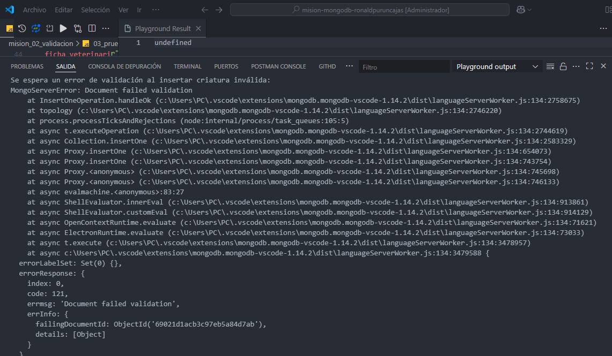

# Analisis de validacion para la mision 2

**Autor:** Ronald Puruncajas 
**Fecha:** 29/10/25

## Descripción General
Esta misión tiene como objetivo proteger la base de datos bestiario frente a datos inválidos mediante reglas de validación estrictas utilizando JSON Schema en MongoDB.  
Se implementaron dos colecciones: guardianes y criaturas, con relaciones embebidas y referenciadas, además de pruebas de inserción válidas e inválidas para comprobar la robustez del esquema.

---

## Contexto del proyecto

```
mision_02_validacion/                    # Carpeta principal
│
├── 01_definicion_guardianes.mongodb     # Creación del schema para guardianes
├── 02_definicion_criaturas.mongodb      # Creación del schema para criaturas
├── 03_pruebas_insercion.mongodb         # Pruebas válidas e inválidas de inserción
├── ANALISIS_VALIDACION.md               # Análisis teórico de las validaciones y relaciones
├── README.md                            # Descripción general de la misión
└── Imagenes/                            # Capturas de pantalla del proyecto
    ├── Imagen1_preparacion_entorno.png
    ├── Imagen2_Crear_Coleccion_guardianes.png
    ├── Imagen3_preparacion_bd_criaturas.png
    ├── Imagen4_crear_coleccion_criaturas.png
    ├── Imagen5_Insercion_dato_correcto.png
    ├── Imagen6_Insercion_datos_incorrectos.png
    ├── Imagen7_Insercion_novalida_criatura.png
    └── Imagen8_Insercion_criatura_valida.png
```

---

## Validaciones del proyecto

### guardianes
- **nombre**: en formato string obligatorio  
- **rango**: enum → ["Aprendiz", "Maestro", "Gran Maestro"]  
- **password_acceso**: regex → mínimo 8 caracteres, 1 mayúscula, 1 número  
- **nivel**: entero entre 1 y 99  
- **inventario**: array de objetos con `{ nombre_item, cantidad >= 1 }`  

### criaturas
- **nombre**, **habitat**, **nivel_peligro**, **es_legendaria**: son obligatorios
- **nivel_peligro**: en formato entero entre 1 y 10  
- **habilidades**: en formato array con al menos 1 string único  
- **ficha_veterinaria**: subdocumento con `salud (enum)` y `ultima_revision (date)`  
- **id_guardian**: referencia al object id al guardián al cual corresponde

---

## Pruebas Realizadas dentro del proyecto

Para las diferentes validaciones se realizo:

- Insert válido del guardián con el nombre Rendolf.
- Insert inválido con rango no permitido y contraseña sin mayúscula ni número.  
  - El error que se deberia esperar: `Document failed validation (code 121)`

- Insert válido de la criatura llamado troll referenciando al guardián con el nombre Rendolf.
- Insert inválido con habilidades vacías y sin el campo de salud.  
  - El error que se deberia esperar: `Document failed validation (code 121)`

---

## Ejemplo de Commits Semánticos

feat: agrega schema de guardianes con validaciones JSON Schema
feat: implementa validación para criaturas con relación 1-1 y 1-N
fix: corrige regex de password en guardianes
test: agrega inserciones válidas e inválidas para verificar reglas
docs: completa análisis teórico de validación y relaciones

---

## Imágenes del Proyecto

### Imagen 1: Preparación del Entorno
Configuración inicial del entorno de trabajo y conexión a MongoDB.


---

### Imagen 2: Crear Colección de Guardianes
Creación de la colección `guardianes` con sus reglas de validación JSON Schema.


---

### Imagen 3: Preparación Base de Datos Criaturas
Preparación de la base de datos para la colección de criaturas.


---

### Imagen 4: Crear Colección de Criaturas
Creación de la colección `criaturas` con validaciones y relaciones a guardianes.


---

### Imagen 5: Inserción de Dato Correcto
Ejemplo de inserción exitosa de un documento válido que cumple con todas las reglas de validación.


---

### Imagen 6: Inserción de Datos Incorrectos
Intento de inserción con datos inválidos mostrando el error de validación (código 121).


---

### Imagen 7: Inserción No Válida de Criatura
Ejemplo de inserción fallida de una criatura que no cumple con el schema definido.



---

### Imagen 8: Inserción de Criatura Válida
Inserción exitosa de una criatura que cumple con todas las validaciones requeridas.


